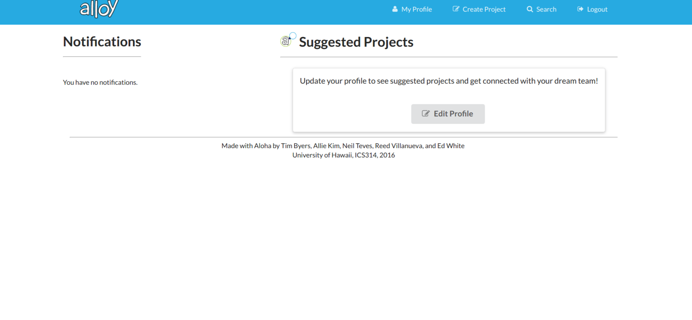
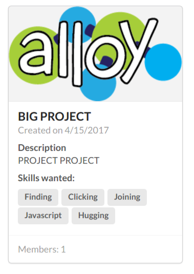
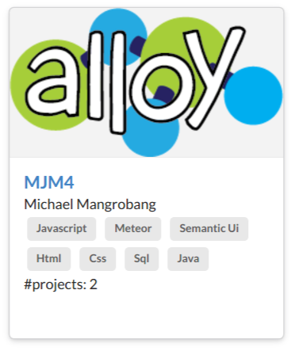
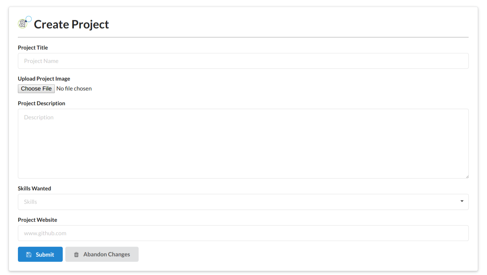
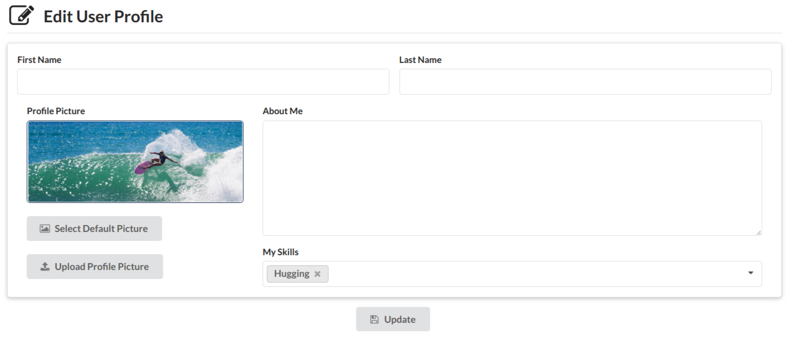
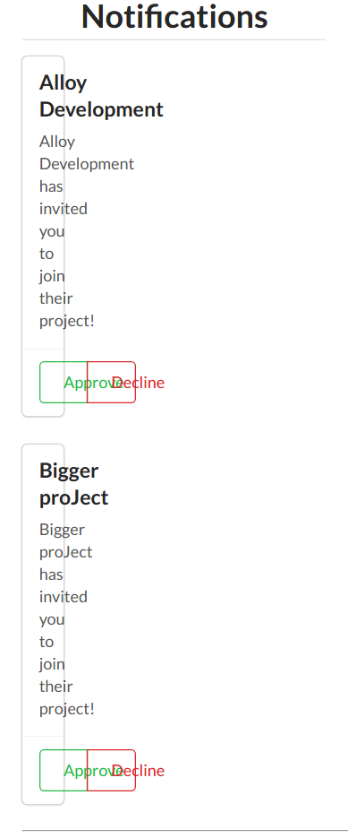
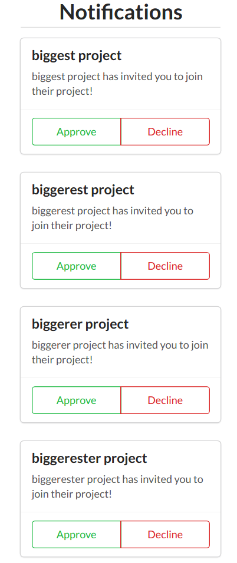

This semester (Spring 2017) I teamed up with [Ed White](https://spyhi.github.io/) and [Neil Teves](https://neilnthings.github.io/) to help out them develop and improve their app <i>Alloy</i>. <i>Alloy</i> aims to connect people through their skills and help them organize and collaborate projects together. In its current state, the app is limited to University of Hawaii faculty and students. To read more about <i>Alloy</i> click [here](https://alloyteams.github.io/).

## January 15, 2017 Update

Since majority of <i>Alloy</i> has already been developed, most of my time spent over the past week was to do simple improvements to get myself accustomed to their code before jumping into the code and possibly messing everything up.

<ul>
  <li><strong>Moved inline styles to global CSS</strong>
   
  While majority of the project was developed, they mostly kept their CSS inline with the HTML code. I was suggested to move the inline CSS to the global CSS file to for easier editting and debugging.
  </li>
  <li><strong>Mobile Scaling</strong>
   
  The layout of the project was well done for desktop viewing, but did not scale so well for mobile. I decided to fix this along the way.
  </li> 
</ul>

## February 16, 2017 Update

Been on a bit of a hiatus, but finally fixed my schedule up to allot time for <i>Alloy</i>. The changes are not that big so far, just fixing up some small errors.

<ul>
  <li><strong>Moved inline styles to global CSS</strong> (again)
   
  I updated the inline css styles to be global last time and pushed those changes to the master branch. After pulling the  most recent master update I noticed that some of the css styles went back to the inline version. This seems to be a      problem on how pushing and pulling is handled on one of our developer's end. Hopefully we can fix this problem soon.
  </li>
  <li><strong>Mobile Scaling on Search Page</strong>
   
  The search page has been updated to be a better fit for mobile scaling. This is a problem I overlooked. Though there are only a few pages in <i>Alloy</i>, it is very easy to overlook which pages has not been scaled for mobile yet. In the future I plan to also scale the Admin Page once that is implemented.
  </li>
</ul>

## March 1, 2017 Update

February is a short month. Less than two weeks after the 16th with a midterm in between. Anyway, here are some small updates on what I did.

<ul>
  <li><strong>Fixed CAS Login/Logout Button</strong>
   
  When hovering over the Login/Logout button in the menu, the color would change letting the user know they can click the button but it did not work unless you were to click on the text itself. This is a problem in the way the tags were handled, especially since the CAS Login is its own template. The fix was not too bad to handle but I did run into some small problems.
  </li>
  <li><strong>Semantic UI Cleanup</strong>
   
  The Semantic UI code in each page is not handled very well. There is a lot of grids/containers within grids/containers. While this works, it is a poor way of handling Semantic UI's way of making webpage layouts. Having so many grids/containers also does make the code a bit harder to read so cleaning this up will make it much easier to read the HTML code to fix, update or add new few features. This will also help in redesigning the UI overall, which I have planned. I have not merged the branch update yet as I have only updated a few pages.
  </li>
</ul>

## March 15, 2017 Update

Did not do as much updating as I wanted to this time around, but I did spend a good amount of time researching to get inspiration and come up with new ideas when redesigning the interface.

<ul>
  <li><strong>Overhaul HTML Code (Semantic UI)</strong>
   
  The HTML code for each page was handled poorly. There is a lot of grids or containers within grids or containers. While this works, it is also a very poor way of handling Semantic UI's way of making webpage layouts. I fixed the accessible pages Semantic UI code. I did come across some problems such as fixing the horizontal rule on some of the headers. The horizontal rule being used was the default HTML5 version and Semantic UI's. When I tried changing it to Semantic UI's version it messed with the <em>Alloy</em> icon's style. I was able to fix this but then it messed with the icon's positioning. I then decided to just fix this issue when I redesign the pages, which is what this update was mostly about. Having to actually fix the sections of containers/grids within the main grid container allowed me to find what I could move around and even help with my planning of adding or redesigning the sections.
  </li>
</ul>

## April 1, 2017 Update

During this update I spent an amount of time researching webpage layouts for the new landing and home page. I did go through a couple iterations, but mainly updated the master with the first rough draft and the "<em>final</em>" draft.

<ul>
  <li><strong>Update Landing Page and Home Page</strong>
   
  During one of our meetings the team decided that the Landing Page needs to be redesigned along with the Home Page. This had to be done together because the previous person to design the original layout made the landing and home page into one. This was not really much of a problem as I do not mind it, but again, the way it was handled could have been designed better. I separated some parts of the page to be its own template and called it from the main template to better organize the code and make it easier to fix/update in the future. The problems I did come across was the projec cards fixing their size relative to the screen size. When looking at the Semantic UI example, it does not do that. While this is not really much of a problem, it is a slight annoyance to me, but will leave it alone if I am not able to fix it. The other problem is testing the notification cards. This is hard because I can't send invites and requests to myself on Meteor's Local Host, so I will need to user test how this looks to see if it does need fixing.
  

    

      <em>Original</em>
      
    

    

      <em>Current</em>
      
    

  

  As you can see I moved the login header to the top, and also added a big login button. I also moved the "About" and "Features" Sections to the bottom of the suggested projects. My thought was to make the login section pleasing to look at, then as users scroll down, they see interesting projects being made and finally the last section of the landing page tells them more about the site if they are interested.
  

    

      <em>Original</em>
      
    

    

      <em>First Draft</em>
      
    

    

      <em>Current</em>
      
    

  

  As I said, I did go through a couple drafts, but mainly updated the master with the first draft then the <em>current</em> final draft. At first, you may see a small change, like the spacing between the "Notifications" and "Suggested Projects" from the original and current. It may not look like much, but there has been a lot of change within the HTML code.
  </li>
</ul>
  
## April 15, 2017 Update

This update is a bit larger than previous updates, but most are small with one or two being big. Though I did spend a few hours struggling and wrapping my head on the "Project Profile" page. On the page I was trying to pull the project member's first and last name. I can not seem to find a fix for it and may end up asking another one of the <i>Alloy</i> members to do it, but it is minor and does not need to be fixed right away. 

<ul>
  <li><strong>Updated Ribbon Colors on User/Project Profile Page</strong>
   
  The update is straight-forward and small. I changed the colors of the ribbons on both the "User Profile" prage and "Project Profile" page. I did this because using CSS on the ribbons did "fully" color it, so you have to use Semantic UI code to get the ribbon to be fully colored.
  </li>
  <li><strong>HTML/CSS Cleanup and Mobile Scaling on Admin Pages (Main/Feed Page, Edit Users/Projects/Skills Page)</strong>
   
  The update is fairly straight-forward also. I updated the admin pages by cleaning their HTML (Semantic UI) and CSS. I simply removed lines of code that do not really need to be there or simply combined lines of code that could be combined into one. This makes the code easier to read overall and will help when updating the layout of the pages to have each section be moved around.
  </li>
  <li><strong>Updated Home Page Feed and Project Card Details</strong>
   
  

    

      <em>Last Draft</em>
      
    

    

      <em>Current</em>
      
    

  

  Some may not see it at first, but I changed the number of cards that can be displayed on the row of the Home Page. One of the biggest problems in the last draft was that the Project Card came up too small and just squeezed everything into card which did not look nice. I spent hours last on the last update trying to fix this, then it was only until recently I told myself, "What if I just reduce how many cards can be on the row?" This simple fix ended working and making the cards nice and wider to display the information much more neatly.
  

    

      <em>Last Draft</em>
      
    

    

      <em>Current</em>
      
    

  

  As you can see the project card is much more legible to read. You can even see that I made the skills wanted into labels once more. I had to remove the labels on the skills last time because they overlapped and overflowed out of the card, instead of moving onto a new line if needed to. As you can see now, the skill labels fit neatly in the card and will move onto a new line if needed.
  </li>
  <li><strong>Modified User Card Layout</strong>
   
  The User Card has been slightly modified, not much to change on it when it is mainly used as a search result.
  

    

      <em>Last Draft</em>
      
    

    

      <em>Current</em>
      
    

  

  As you can see I switched the places of the username and the user's first and last name. I did this just as a standard edit, since most social media websites display the person's name first and make it the hyperlink, followed by other information such as their email in the following description. I also made the skills into their own section and updated the grammar on the number of projects.
  </li>
  <li><strong>Updated Create/Edit Project Profile and Edit User Profile UI</strong>
   
  One of the bigger updates I did. The UI is more or less the same, but I did move things around.
   
  
Create/Edit Project

  

    

      <em>Last Draft</em>
      
    

    

      <em>Current</em>
      
    

  

  
Edit Profile

  

    

      <em>Last Draft</em>
      
    

    

      <em>Current</em>
      
    

  

  As you can see I move the tite of the page and the "Submit" button out of the segment for the Create/Edit Project pages (do note that these pages look similar) and moved the URL form up. I also added a segment in the Edit User page, to keep it looking consistent. I did this because most websites now days like to have their edit profile pages looking exactly like what they will look when finished editing. This is also the reason why I moved the title and button out of the segment and added a segment to the Edit User page. The segment is to help the user visual that this is what the page will look like without the title. As you can see there is also buttons that either have the words "default" or "upload", this is in preparation for selectable default images or uploadable images.
  </li>
</ul>

## May 1, 2017 Update
This is a smaller update this time around, I was much busier than I expected this past couple of weeks. I did manage to fix a big User Interface problem with the website. Other than that I did not run into much problems other than trying to login because another <em>Alloy</em> developer was playing with the database, luckily I got it fixed.

<ul>
<li><strong>Fix Notification Cards</strong>
 

  

    <em>Before</em>
    
  

  

    <em>After</em>
    
  

 
As you can see the notification cards were not fitting nicely on the homepage. The error was a pretty simple fix, as it turns out the div tag declaring a set of cards was in the each loop. This made the webpage create a container wanting to fit a set of cards each time when there was only a need of one.
</li>
</ul>

## Upcoming Features

<ul>
  <li><strong>Object-Oriented Templates</strong>
   
  <em>Jan 15, 2017</em>
   
  While doing simple improvements I also had to find similarities within the HTML to turn into templates and treat them as objects to pass around the files.
   
  <em>Apr 15, 2017</em>
   
  This update will always happen as I come across them.
  </li>
  <li><strong>Default Profile Images</strong>
   
  <em>Jan 15, 2017</em>
   
  Give users a few images to select from as a profile picture. Having implemented something similar in a previous project, I will bring over the code and improve it to be able to give users a selection of images to use for their profile.
   
  <em>Apr 15, 2017</em>
  Prepared the "Edit Profile Page" for this.
  </li>
  <li><strong>Fix UI Problems after User Testing and Update Other Pages UI</strong>
   
  <em>Apr 1, 2017</em>
   The Landing and and mainly the Home Page does need some user testing after being updated. I can not really view notifications when developing on my end as I can not really send invites to myself. I will need to see how they look with user testing and fix them. I may also update the UI for the other pages.
   
  <em>Apr 15, 2017</em>
   
  This update will happen when problems occur and when I see fit.
  </li>
</ul>
