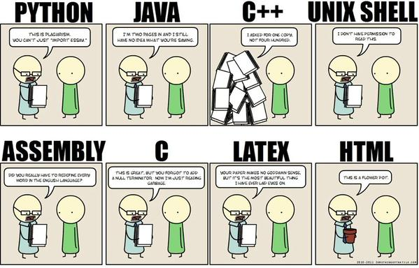

Whenever I look at my old code from when I first started programming, the harder I find it to decipher. Back then I would just keep on adding onto lines or adding more lines to my code, which in the end, made the code very messy. Though the code was messy, it was not as I could still understand it the next day if I needed to fix it. I also thought that the future me was not going to refer to this old code anyway, but I was wrong.

Having take more ICS courses throughout the years, I found more and more professors wanting your code to follow their specific coding standard. Unlike some people, I did not find myself disliking the idea, instead I actually enjoyed it. As soon as the professors told us how their coding standards I found that reading code was a hundred times better.

With coding standards making code easier to read, it also made learning a programming language much easier too. Having a specific coding standard for people not only allows you to read your own code much easier, but for other people to read your code much easier and vice versa! There are many different ways to approach a problem when coding, and each of us will find one of those solutions. Since learning a coding standard makes reading the code easier, we learn the many other approaches to solve the problem from other people's solution, which in turn, helps us learn the programming language more.

Having already learned other professor's coding standards, using ESLint with Intellij over the past week does not bother me at all. Since I already have learned some form of coding standard from my previous ICS courses, I do not run into errors from ESLint. Having ESLint enabled is, more or less, just there to keep me in check. Though ESLint does not do too much for me now, it will start to shine later on throughout the semester. Having a coding standard for the class will make group projects much easier to collaborate and learn from.

