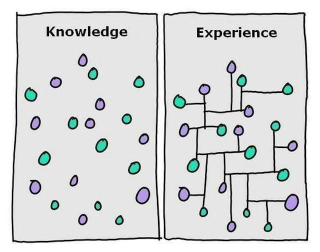

## The Irony

Years ago, and even now, many civilizations look up to the night sky to help them throughout their life. From farming to warfare, and even one of my favorites, navigation. I am thinking about this now because I do find these past two weeks ironic. While I knew that at some point I would have to learn an application to help navigate data between client and server, I just did not expect it to be called <em>Meteor</em>. Nevertheless, I enjoyed these past two weeks using <em>Meteor</em> just as much as I enjoy Astronomy.

## Knowledge vs Experience

Whether the navigation was through a dense forest or an open ocean, they had to have both the knowledge and experience to have a higher success rate. When navigating they had to learn about landmarks to constellations, this was the knowledge. However, this did not mean much without experience, the ability to connect these pieces of knowledge together. In relation to <em>Meteor</em>, what I found easy was learning about and how to use each of its uses, from the functions to templates, with the most difficult part being able to use and connect them all together.

## Beginner Friendly

Navigation through the use of the sky still fascinates me to this day, which is what I find cool about <em>Meteor</em> and its use of <em>MongoDB</em>. Though I do not dislike SQL, I really enjoy <em>Meteor's</em> way of interacting with the database versus writing SQL statements. Although <em>Meteor</em> may be my first client-server application, but I would have to say that it is great as an application architecture, especially for those using one for the first time.
