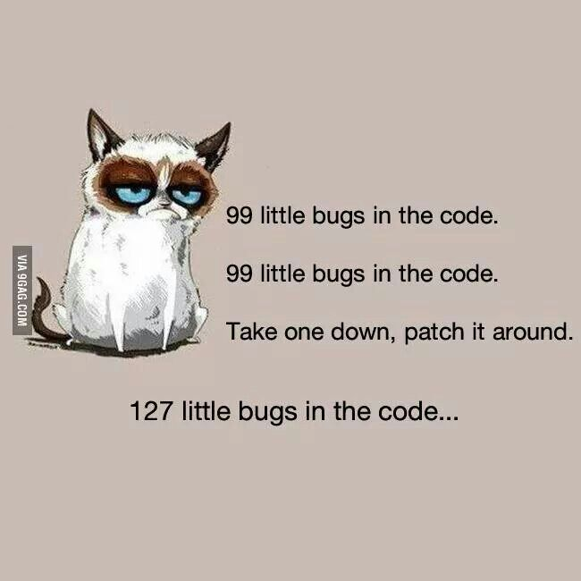

From playing with Legos to drawing with a pencil, building and designing has always been a concept that I have been fascinated with. To see the little intricate designs within something someone built is very impressive and amazing. There is also this, feeling, a sense of accomplishment that feels amazing when you can look at what you built or designed and say "Yeah, I made that." Combining this exact feeling along with the adding little intricate designs is why I decided to take Computer Science as a major. 

Programming is just as I imagined. With the intricacies being the amount of lines to type, just to have them fall together to build an application or even a website, is something I enjoy. Programming does have its nightmares though. The amount of hours one could put into a debug can be a real headache but this is where the sense of accomplishment comes back into play. Once the bugs have been found and fixed, after so long, that sense of accomplishment escalates even more.

I have now started to attend a Software Engineering class, a very particular one that I have been looking forward to. Within this class, we need to write out working code within just a few minutes, an experience I am realy looking forward to. To be able to compress the debugging frustrations does sound like even more of a nightmare but also even more rewarding. As much as I do enjoy the sense of accomplishment, I do also enjoy helping and giving joy to other people. With that said, by the end of this course I do hope to learn a lot more about Software Engineering to help me build more useful and practical software for people to use.
